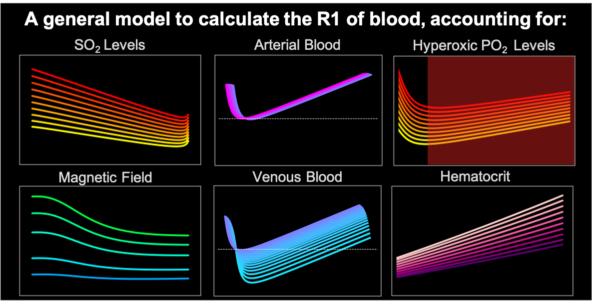

 
# A general model to calculate the spin-lattice relaxation rate (R1) of blood, accounting for haematocrit, oxygen saturation, oxygen partial pressure, and magnetic field strength under hyperoxic conditions

#### Emma Bluemke, Eleanor Stride, Daniel Bulte

Institute of Biomedical Engineering, Department of Engineering Sciences, University of Oxford, UK

Questions? Raise an issue here on GitHub

## Abstract

Under normal physiological conditions, the R1 (1/T1) of blood is influenced by many factors, including haematocrit, field strength, temperature, protein concentrations, and the weak paramagnetic effects of deoxyhaemoglobin and dissolved oxygen. In addition, techniques such as oxygen-enhanced MRI require high fractions of inspired oxygen to induce hyperoxia, which complicates the R1 signal further. Whilst a linear increase in R1 with oxygen partial pressure has been reported in phantoms, measurements in blood have produced contradictory effects. A quantitative model relating total blood oxygen content to R1 could help explain these contradictory effects. 
 
Existing models for blood R1 can account for SO2, haematocrit, and magnetic field strength (B0), but are not applicable under conditions of artificially increased PO2, or hyperoxic experiments. Therefore, we present a general model to estimate the R1 of blood, accounting for haematocrit, SO2, PO2, and B0 under both normal physiological and normobaric hyperoxic conditions. The model estimates agreed well with literature values (R2=0.93, MSE=0.0013 s-2) and the model performance was consistent across R1, SO2, PO2, B0 and Hct levels, valid for the following parameter ranges: B0=1.5-8.45T, SO2=0.40-1, PO2=30-700mmHg.

## About this notebook

As a future direction of this work, we have hosted the open-source model code and a current list of blood R1 measurements here on GitHub and invite the MRI community to share new blood R1 measurement results and refit the model to improve accuracy. Such a project would greatly improve this model as T1, Hct, SO2 and PO2 measurement methods continue to improve in accuracy over the years to come. 

